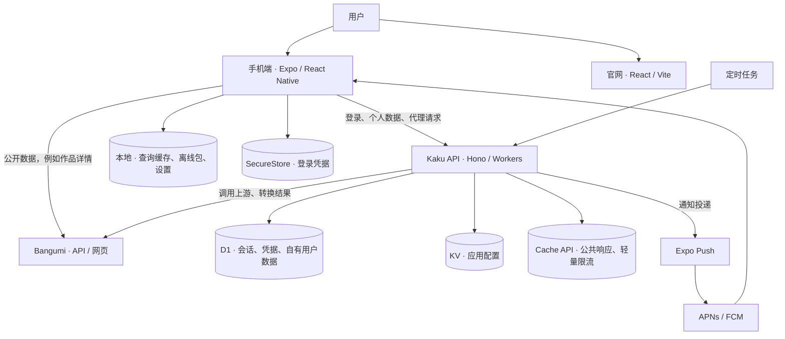
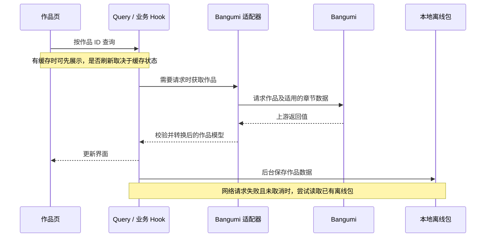
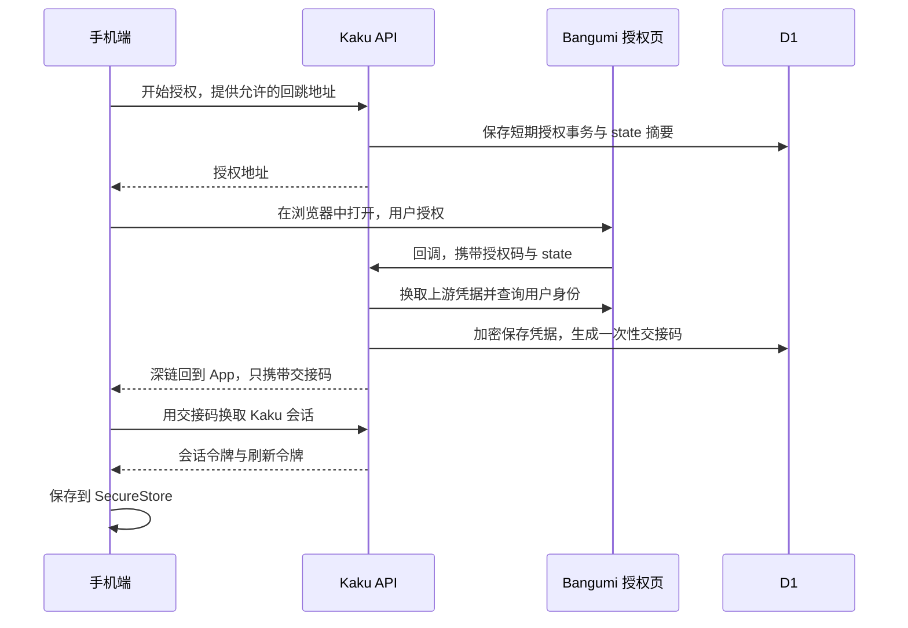

# Kaku 技术架构

本文按“项目由什么组成 → 数据怎么流动 → 为什么这样分层 → 改功能去哪里”梳理当前实现。它描述代码已经做的事情，不把计划当成现有能力。

## 1. 先抓住主线

Kaku 是独立开发的兴趣作品管理与讨论客户端。用户在手机上浏览作品、管理收藏和观看进度、参与讨论。项目还包含一个后端 API 和一个产品官网。

理解架构，先记住三句话：

- **手机端管体验**：页面、导航、交互、请求状态和本地缓存。
- **Bangumi 管主要业务数据**：作品、章节、收藏、进度和讨论的最终结果在上游。
- **Kaku API 管自己的账户连接和数据**：保管上游凭据，验证 Kaku 会话，代理需要身份的操作，保存偏好、历史和推送设备等数据。

因此，Kaku 不是把 Bangumi 数据全部搬进自己的数据库。公开作品详情可以由手机直连上游；登录和需要保密凭据的请求交给后端。部分公开能力也经过后端聚合或解析。



官网是单独部署的产品介绍站，不是手机端业务页面的 Web 版本。

## 2. 仓库与技术分工

项目使用 pnpm workspace。也就是把几个应用放在同一个仓库，统一安装依赖、执行检查，并让它们引用少量共享代码。

```text
kaku/
├── apps/mobile/          手机应用
│   └── src/
│       ├── app/         文件路由与页面入口
│       ├── features/    按业务组织的模型、Hook 和界面
│       ├── infrastructure/  Bangumi 与 Kaku API 的接入代码
│       ├── lib/         查询缓存、网络状态、诊断等公共能力
│       └── constants/   设计规范等常量
├── apps/api/             Hono 后端，运行在 Cloudflare Workers
│   ├── src/             按业务组织路由、上游客户端、存储
│   └── drizzle/         数据库迁移
├── apps/web/             React / Vite 官网
├── packages/shared/      少量公共枚举、类型与校验函数
├── scripts/              构建、发布等脚本
└── docs/                 测试、部署、项目说明
```

| 部分 | 主要技术 | 在这里解决什么问题 |
| --- | --- | --- |
| 手机界面 | React、React Native、Expo | 用 React 组织界面，通过原生组件运行在 iOS 和 Android |
| 导航 | Expo Router | 用文件路径组织页面，连接原生导航栈与深链 |
| 远端数据 | TanStack Query | 统一请求状态、缓存、刷新、重试和修改后的数据同步 |
| 列表与交互 | FlashList、Reanimated、Gesture Handler | 长列表复用、动画与手势处理 |
| 手机存储 | SecureStore、SQLite KV | 分别保存登录凭据和普通本地数据 |
| 后端路由 | Hono | 把 HTTP 请求分配给相应业务处理函数 |
| 数据校验 | Zod | 运行时检查输入或接口返回值，避免只靠 TypeScript 假设数据正确 |
| 后端存储 | D1、Drizzle ORM | 使用 SQL 数据库保存 Kaku 自有数据，用代码定义表和查询 |
| 运行平台 | Cloudflare Workers | 承接 API 请求和定时任务，无需自己维护常驻服务器 |
| 官网 | React、TypeScript、Vite | 产品说明、隐私政策、服务条款与多语言展示 |

`packages/shared` 目前主要共享主题、语言、收藏状态等小型定义。它还不是覆盖全部接口的统一协议包。

## 3. 手机端：页面下面有哪些层

### 3.1 启动时先把公共能力接起来

入口是 [根布局](/Users/shqingda/Projects/kaku/apps/mobile/src/app/_layout.tsx)。它创建全局 QueryClient，并将登录、偏好、搜索历史、最近浏览和主题等 Provider 包在导航外面。

**Provider 可以理解为公共服务入口**：页面不需要各自恢复一遍登录信息，而是从同一个 AuthProvider 获取当前用户和请求方法。

主要启动关系是：

```text
错误边界 / 手势根容器
  → 可持久化的 QueryClient
    → 登录状态
      → 偏好、搜索历史、最近浏览
        → 主题
          → 页面导航与离线提示
```

应用回到前台时会通知 Query 的 focusManager；网络状态会通知 onlineManager。查询是否实际重新请求，还取决于是否过期、是否启用及自身配置，不是每次切回应用都强制刷新全部内容。

### 3.2 页面、业务与外部接口分开

以作品详情为例：

```text
app 中的页面入口
  → features/catalog 中的界面与 useCatalogSubject
    → infrastructure/bangumi/catalog/provider
      → 上游客户端、返回值校验、HTTP 请求
        → Bangumi
```

- **页面层**决定展示什么、用户可以做什么。
- **业务 Hook**连接页面与查询状态，例如“正在加载”“有旧数据但正在刷新”。Hook 是把可复用状态逻辑组织成函数的 React 方式。
- **适配层**把外部字段转换为 Kaku 使用的模型。例如把章节的 `ep` 转成 `number`，把评论数量转换为 `discussionCount`，处理标题回退和章节排序。
- **传输层**负责请求、超时、取消和 HTTP 错误。

这样，上游字段发生变化时，优先修改适配层，不必让每个页面跟着改。

但这仍是分层方向：部分 Hook 直接引用 Bangumi 实现，命名和数据能力也有耦合。目前不能说“换一个数据源完全不用动业务代码”。

代码入口：[作品查询](/Users/shqingda/Projects/kaku/apps/mobile/src/features/catalog/use-catalog-subject.ts)、[作品适配器](/Users/shqingda/Projects/kaku/apps/mobile/src/infrastructure/bangumi/catalog/provider.ts)、[请求封装](/Users/shqingda/Projects/kaku/apps/mobile/src/infrastructure/bangumi/transport/http-client.ts)。

## 4. 沿着三条用户操作看数据流

### 4.1 打开一个作品



Query Key 是“缓存条目的名字”。同一个作品查询需要使用一致的 key，才能共享缓存；带身份的数据还需要区分用户。

作品查询的 `staleTime` 是 5 分钟，意思是这段时间内数据可以视为新鲜，并不代表 5 分钟后删除。用户按下作品卡片时也会短暂延迟后预取数据，松手或滑动取消可以避免多余请求。

网络获取成功后，保存离线包在后台进行；保存失败只记录诊断，不阻塞已经拿到的作品展示。网络失败时尝试读取离线包，取消的请求则直接结束，不继续做离线回退。

### 4.2 登录：为什么要经过自己的后端

OAuth 是“用户允许 Kaku 使用其 Bangumi 账户能力”的授权流程。手机不需要拿到用户的 Bangumi 密码，后端也不把上游访问凭据交给手机。



这里有三种不同的东西：

| 名称 | 用途 | 保存方式 |
| --- | --- | --- |
| 上游凭据 | 后端代表用户请求 Bangumi | 后端 AES-GCM 加密后写入 D1 |
| Kaku 会话令牌 | 手机调用 Kaku API 时证明身份 | 手机 SecureStore；后端保存 SHA-256 摘要 |
| 刷新令牌 | 会话快过期时换取新会话 | 手机 SecureStore；后端保存摘要并在刷新时轮换 |

Kaku 会话使用随机字符串，不是 JWT。后端需要查存储确认它是否有效，因此可以撤销会话。

关键时限是：授权事务 5 分钟、一次性交接码 60 秒、会话令牌 1 小时、刷新令牌 90 天；刷新成功会重新计算刷新期限。深链就是能够唤起 App 的地址，交接码让这一步不用直接暴露长期登录凭据。

手机端会合并同时发生的刷新请求。带身份请求遇到 401 时，尝试刷新并重试一次；临时网络错误与确认失效会分别处理。后端轮换刷新令牌时核对旧摘要，旧令牌再次使用会失败，但没有实现整套“令牌家族盗用检测”。

退出当前设备、撤销其他设备和断开连接是不同操作。断开连接会清除 Kaku 保存的凭据及会话，不等于调用 Bangumi 撤销其上游授权。

代码入口：[手机登录状态](/Users/shqingda/Projects/kaku/apps/mobile/src/features/auth/auth-provider.tsx)、[授权路由](/Users/shqingda/Projects/kaku/apps/api/src/auth/routes.ts)、[会话服务](/Users/shqingda/Projects/kaku/apps/api/src/auth/session-service.ts)、[凭据加密](/Users/shqingda/Projects/kaku/apps/api/src/auth/crypto.ts)。

### 4.3 修改收藏或进度

手机不会直接把自己的界面状态当成最终结果。它先反馈操作，再向后端提交，后端使用上游凭据写入 Bangumi。

以收藏修改为例：

1. 取消同一条收藏正在进行的查询，保存旧数据。
2. 先更新本地查询缓存，让用户立即看到变化，这叫**乐观更新**。
3. 手机通过 Kaku API 提交修改，后端验证会话后请求 Bangumi。
4. 成功：用返回结果校准缓存，并让相关收藏列表重新核对数据。
5. 失败：恢复旧数据，并重新查询，避免界面停在没有保存成功的状态。

同一收藏 key 的修改通过 mutation scope 串行处理，减少连续操作相互覆盖。这里的“串行”是排队提交同一范围的修改，不代表解决了跨设备的一切并发问题。

**最终状态仍以 Bangumi 为准。** 当前没有可在离线时排队、联网后自动补交的写入队列。

代码入口：[个人收藏查询与修改](/Users/shqingda/Projects/kaku/apps/mobile/src/features/collections/use-personal-collection.ts)、[后端收藏路由](/Users/shqingda/Projects/kaku/apps/api/src/collections/routes.ts)。

## 5. 数据究竟存在哪里

| 数据 | 保存位置 | 承担的职责 |
| --- | --- | --- |
| 作品、章节、收藏、讨论 | Bangumi | 上游业务数据的最终来源 |
| 用户映射、授权事务、会话、加密凭据 | D1 | Kaku 的身份连接与访问控制 |
| 偏好、搜索历史、最近浏览、推送设备 | 本地与 D1 中各自对应的数据 | 本机使用、账户同步或推送投递 |
| 应用配置 | Cloudflare KV | 后端读取并提供应用配置 |
| 可缓存的公共 API 响应 | Workers Cache API | 减少重复请求上游 |
| 查询结果 | 手机内存与 SQLite KV | 快速展示、重启后恢复缓存 |
| 最近作品离线包 | 手机本地存储 | 请求失败时仍能打开已保存的作品数据 |
| 手机登录凭据 | SecureStore | 使用系统提供的安全存储能力 |

数据库结构见 [schema.ts](/Users/shqingda/Projects/kaku/apps/api/src/db/schema.ts)。D1 不是作品库的完整副本，也不替代 Bangumi 保存用户收藏。

### 5.1 查询缓存与离线包不是一回事

- **查询缓存**：覆盖被标记为允许持久化且成功的查询。全局 `gcTime` 和持久化 `maxAge` 都是 24 小时，前者控制不再被使用的内存缓存保留时间，后者限制磁盘缓存恢复时的年龄。
- **作品离线包**：单独保存最近最多 10 个作品，有效期 30 天；读取时带上离线来源标记。保存的是作品与章节等数据，不保证图片文件也被完整下载。
- **修改操作**：没有持久化。根布局明确不保存 mutations，不能把“能离线看”理解成“能离线提交”。

持久化虽然使用名为 `createAsyncStoragePersister` 的工具，实际底层是 `expo-sqlite/kv-store`，不是另一套 AsyncStorage 数据库。

私人查询可以持久化到普通 SQLite。代码使用用户相关 key、私人标记和退出后的清理减少混用，但它不是加密存储，也不能宣称完全消除了恢复缓存到清理完成之间的短暂窗口。登录凭据与普通查询缓存需要分别看待。

代码入口：[持久化规则](/Users/shqingda/Projects/kaku/apps/mobile/src/lib/query-persistence.ts)、[磁盘存储接入](/Users/shqingda/Projects/kaku/apps/mobile/src/lib/query-persister.ts)、[离线作品包](/Users/shqingda/Projects/kaku/apps/mobile/src/features/catalog/offline-subject-pack.ts)。

### 5.2 偏好同步

偏好先在手机上生效并保存本地；登录且启用云同步时，再读取或提交云端偏好。同步失败有独立错误状态，不应阻止本机切换主题。同步先等待本地设置恢复；云端请求串行执行，并校验本地编辑版本。设备级同步开关不由云端响应回写。

搜索历史和最近浏览保留各自 Provider 与合并规则，但共用 `useSyncedHistory` 调度读取、写入和前台刷新。本地缓存按账号（另含游客）隔离；切换账号、关闭同步或卸载 Provider 时取消旧任务，迟到结果不再回写。旧版没有账号归属的全局历史不自动导入新缓存，已同步历史由云端恢复。它们属于 Kaku 自有数据，与“调用 Bangumi 修改收藏”是两条不同的数据路径。

## 6. 后端：路由、存储与上游接入

[app.ts](/Users/shqingda/Projects/kaku/apps/api/src/app.ts) 创建 Hono 应用，注册全局限流、业务路由、404 和异常处理；[index.ts](/Users/shqingda/Projects/kaku/apps/api/src/index.ts) 是 Worker 的 HTTP 与定时任务入口。

业务模块通常按职责拆开：

```text
routes.ts          接收参数、验证身份、组织处理流程、返回响应
model.ts           定义或校验数据结构（有需要的模块）
bangumi-client.ts  与上游接口或网页交互（有上游依赖的模块）
store.ts           读写 Kaku 自有数据（需要持久化的模块）
```

不是每个模块都需要全部文件。收藏主要访问上游，偏好主要访问自己的数据库，职责不同就不强求同一种模板。

部分功能不能只靠上游公开 JSON API 完成，因此后端还有网页解析。JSON 是结构化数据；网页解析则需要从 HTML 标签中提取数据，更容易受上游页面改版影响，所以项目保留了 HTML 解析监测与回归检查。

### 6.1 缓存、限流与失败处理

公共响应缓存按请求 URL 查找，成功响应才写入，并通过 `X-Kaku-Cache` 标记命中情况。实际缓存时长取决于响应的 `Cache-Control` 等配置；公共缓存不能直接拿来缓存带个人身份的响应。

限流按客户端 IP 区分读、写请求：当前窗口 60 秒，读请求上限 180 次，写请求上限 40 次，健康检查豁免。计数也使用 Cache API，是挡突发滥用的轻量方案，不具备跨 Worker 实例的严格一致性。

手机端 Bangumi 请求封装使用 12 秒超时，并区分超时、网络错误、取消和 HTTP 错误。Query 全局默认对大多数 4xx 不重试，408、429 等例外及其他可重试错误最多重试两次；延迟按 `600 × 2^尝试次数` 增长，上限 3 秒。单个查询仍可覆盖默认配置。

界面分别表达首次加载、旧数据刷新、离线内容和失败重试。网络明确不可达时展示离线提示，未知网络状态不会直接判成离线。后端未捕获异常统一记录日志并返回通用错误，避免把内部细节直接发给客户端。

## 7. 推送：定时检查，而不是实时长连接

手机获得通知权限与设备推送 token 后向 API 登记。后端每 15 分钟为已登记的用户检查上游通知，再经 Expo Push、APNs / FCM 投递到设备。

游标记录“已经处理到哪条通知”。每个设备首次建立游标时只记录当前位置，不补发旧消息，也不改变其他设备的游标；后续按设备游标选择未读新通知，相同游标的设备批量发送，并清理被判定无效的设备 token。本机关闭推送或退出时，注销请求携带本机 token，后端以用户和 token 共同限定删除范围。

这带来几个实际边界：通知可能有轮询延迟；投递还依赖上游、Expo 和系统服务；不是每条消息严格只到达一次的保证。缺少推送服务凭据时会记录失败，不推进游标来假装已发送。

另一个每日定时任务负责清理过期授权数据。调度定义见 [wrangler.jsonc](/Users/shqingda/Projects/kaku/apps/api/wrangler.jsonc)，流程见 [push/poll.ts](/Users/shqingda/Projects/kaku/apps/api/src/push/poll.ts) 和 [push/deliver.ts](/Users/shqingda/Projects/kaku/apps/api/src/push/deliver.ts)。

## 8. 界面与官网各自的边界

手机端通过 Expo Router 组织作品、单集、收藏、讨论和个人设置等页面。共用字号与间距来自 [design.ts](/Users/shqingda/Projects/kaku/apps/mobile/src/constants/design.ts)，交互动画由 Reanimated 和 Gesture Handler 等实现。

单集评论页使用 FlashList，主要作用是复用列表项、减少长列表的渲染负担。当前“滚动到底部”入口隐藏，FlashList 保留。列表性能能力与是否显示某个操作入口是两件独立的事，也不能仅凭使用 FlashList 就推断所有场景没有卡顿。

官网使用自己的 React 入口与路径分发，提供首页、隐私政策、服务条款和多语言内容，作为静态资源独立部署。手机端的登录 Provider 和业务 Query 缓存不在官网复用。

## 9. 如何验证与交付

验证分几层，各自证明不同的事情：

| 检查 | 能说明什么 |
| --- | --- |
| TypeScript 与依赖检查 | 类型和依赖兼容性满足当前检查规则 |
| Node 测试 | 数据转换、业务纯逻辑、API 等行为符合测试断言 |
| Jest / React Native Testing Library | 组件在测试环境中的渲染和交互符合预期 |
| HTML 解析回归 | 已覆盖的上游页面结构仍能正确提取数据 |
| Expo export | iOS / Android JavaScript 资源能完成打包 |
| 原生构建与设备测试 | 原生依赖能编译，以及实际设备上的功能与交互表现 |

CI 负责自动检查与打包验证；`expo export` 成功不等于 APK 或 iOS 原生安装包已经构建成功，也不等于设备测试通过。

手机 Android 发布走仓库构建脚本与 GitHub Release 流程；API 单独执行数据库迁移和 Worker 部署；官网独立构建部署。修改一个应用，不意味着三个应用都要重新发版。

运行命令看 [README](/Users/shqingda/Projects/kaku/README.md)，检查方法看 [测试说明](/Users/shqingda/Projects/kaku/docs/development/testing.md)，Android 发版看 [RELEASE](/Users/shqingda/Projects/kaku/docs/deployment/release.md)，后端部署看 [deploy-api](/Users/shqingda/Projects/kaku/docs/deployment/deploy-api.md)。这些文档负责具体操作，本文负责解释它们之间的关系。

## 10. 改一个功能，从哪里下手

| 想改什么 | 优先看哪里 |
| --- | --- |
| 页面内容、按钮、列表 | `apps/mobile/src/app` 的路由入口，再到对应 `features` 界面 |
| 请求状态、缓存、修改后刷新 | 对应业务 Hook、`lib/query-keys.ts` 与持久化规则 |
| 上游字段变化 | 手机 `infrastructure/bangumi` 或 API 对应模块的 `bangumi-client.ts` |
| 登录失效、刷新、设备会话 | 手机 `features/auth` 与 API `auth` |
| 新增 Kaku 自有数据 | API 业务模块、`db/schema.ts`、`drizzle` 迁移，再接手机客户端 |
| 通知到达或点击跳转 | API `push` 与手机 `features/push` |
| 官网内容 | `apps/web/src` |

建议第一次阅读代码时只跟一条链：**根布局 → 作品查询 → 作品适配器 → 收藏修改 → 登录服务 → 数据库结构**。先理解一个操作如何从页面走到最终数据源，再横向看其他模块，会比逐个目录阅读更容易建立整体印象。
